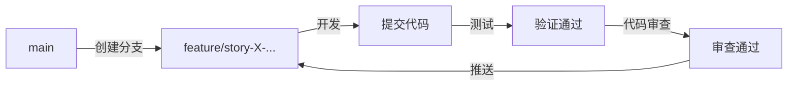

# Git 工作流规范

> **版本：** 1.1
> **最后更新：** 2026-03-06
> **目的：** 规范 Git 分支管理和开发流程

---

## 🌿 分支管理规范

### 功能开发分支

每个 Story 或功能开发**必须**从 `main` 分支创建新的功能分支。

#### 分支命名

```
feature/story-{Epic编号}-{Story编号}-{简短描述}
```

**示例：**
- `feature/story-2-2-points-setting` - Story 2.2 积分值设置
- `feature/story-1-7-member-management` - Story 1.7 成员管理
- `feature/auth-phone-login` - 手机号登录功能

#### 工作流程

```bash
# 1. 切换到 main 分支
git checkout main
git pull origin main

# 2. 创建功能分支
git checkout -b feature/story-2-2-points-setting

# 3. 开发、提交
git add .
git commit -m "feat: implement points input component"

# 4. 推送到远程
git push -u origin feature/story-2-2-points-setting

# 5. 代码审查
# 创建 Pull Request
# 等待代码审查通过

# 6. 推送到服务器
git push
```

---

### Bug 修复分支

#### 分支命名

```
fix/{bug描述或issue编号}
```

**示例：**
- `fix/login-crash-on-ios` - iOS 登录崩溃修复
- `fix/issue-123-payment-fail` - Issue #123 支付失败修复

---

### 禁止用于功能开发的分支

以下分支类型**禁止**用于功能开发，仅用于临时调试或测试：

| 分支类型 | 示例 | 用途 | 禁止操作 |
|----------|------|------|----------|
| E2E 测试分支 | `fix-e2e` | 调试 E2E 测试 | ✗ 开发新功能 |
| 快速修复分支 | `hotfix-xxx` | 紧急修复 | ✗ Story 开发 |
| 实验分支 | `experiment-xxx` | 尝试性代码 | ✗ 正式功能 |

**⚠️ 常见错误案例：**

> **错误：** 在 `fix-e2e` 分支上开发 Story 2.2
> **正确：** 从 `main` 创建 `feature/story-2-2-points-setting` 分支
> **注意：** 功能分支保留用于代码审查，不立即合并到 main

---

## 🔄 完整开发工作流

### Story 开发流程



### 步骤详解

#### 1. 开始开发前

```bash
# 确保在 main 分支且是最新的
git checkout main
git pull origin main

# 创建功能分支
git checkout -b feature/story-{Epic}-{Story}-{name}

# 确认当前分支
git branch
```

#### 2. 开发阶段

```bash
# 频繁提交，保持提交原子性
git add components/xxx.ts
git commit -m "feat: add points input component"

git add tests/xxx.spec.ts
git commit -m "test: add integration tests for points"
```

#### 3. 提交前验证

```bash
# 类型检查
bun tsc --noEmit

# 运行测试
bun test

# 确保无未提交的意外文件
git status
```

#### 4. 完成开发

```bash
# 推送到远程功能分支
git push

# 代码审查阶段
# 创建 Pull Request
# 等待代码审查通过
# 审查通过后，推送到服务器
git push
```

---

## 📋 提交信息规范

### 提交类型

| 类型 | 说明 | 示例 |
|------|------|------|
| `feat` | 新功能 | `feat: add points input component` |
| `fix` | Bug 修复 | `fix: resolve race condition in balance update` |
| `refactor` | 重构 | `refactor: extract validation logic` |
| `test` | 测试 | `test: add integration tests for AC #1` |
| `docs` | 文档 | `docs: update API documentation` |
| `chore` | 构建/工具 | `chore: update dependencies` |

### 提交格式

```
<类型>: <简短描述>

<详细说明（可选）>

<相关 issue 或 Story（可选）>

Refs: #<issue编号>
Story: X-Y
```

**示例：**
```bash
git commit -m "feat: implement points validation (1-100)

Add PointsInput component with real-time validation
and error feedback.

Story: 2-2
Refs: #123"
```

---

## ⚠️ 常见错误与解决方案

### 错误 1：在错误的分支上开发

**症状：** 在 `fix-e2e` 或 `main` 分支上直接开发功能
**后果：** 代码混乱，难以追踪每个 Story 的变更
**解决：** 立即停止，创建正确的功能分支，`git cherry-pick` 迁移提交

### 错误 2：功能分支命名不规范

**症状：** 使用 `my-feature`、`update` 等模糊命名
**后果：** 难以识别分支对应的 Story
**解决：** 使用 `feature/story-X-Y-{name}` 格式

### 错误 3：功能分支过早删除

**症状：** 代码审查未通过就删除功能分支
**后果：** 丢失审查历史，难以追踪审查意见
**解决：** 功能分支保留到审查通过后再处理

---

## 🔍 分支管理检查清单

### 开始开发前

- [ ] 当前在 `main` 分支
- [ ] `main` 分支已更新到最新
- [ ] 创建了规范命名的功能分支

### 开发过程中

- [ ] 在功能分支上提交（非 main 或临时分支）
- [ ] 提交信息遵循格式规范
- [ ] 频繁提交，保持变更原子性

### 提交前

- [ ] 所有测试通过（`bun test`）
- [ ] 类型检查通过（`bun tsc --noEmit`）
- [ ] 无未跟踪的意外文件（`git status`）
- [ ] 代码审查已完成

### 审查完成后

- [ ] 代码审查通过
- [ ] 所有测试通过
- [ ] 功能分支已推送到远程

---

## 📚 相关文档

- **[AGENTS.md](../AGENTS.md)** - AI 决策手册
- **[docs/TECH_SPEC_TESTING.md](./TECH_SPEC_TESTING.md)** - 测试规范
- **[docs/TECH_SPEC_BDD.md](./TECH_SPEC_BDD.md)** - BDD 开发规范

---

## 📝 变更日志

| 日期 | 版本 | 变更 |
|------|------|------|
| 2026-03-06 | 1.1 | 修复：添加代码审查环节，功能分支保留不合并到 main |
| 2026-03-06 | 1.0 | 初始版本，响应 fix-e2e 分支错误事件 |
